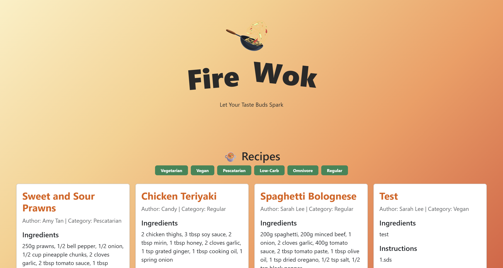

#  FireWok

**Let Your Taste Buds Spark**

FireWok is a recipe management application built with React and connected to a hosted Express API.

Image 1: This is the image for the website.

## Frontend Base URL
https://firewok-app-flax.vercel.app/

## Features

- View recipes
- Create new dishes
- View recipe categories
- Add new authors
- View author list
- Recipe pagination
- API error handling
- PostgreSQL database

## Tech Stack

- React
- JavaScript
- Bootstrap
- Express
- PostgreSQL
- Supabase
- Railway

## API Endpoints

| Method | Endpoint | Description |
|---|---|---|
| GET | `/recipes` | Get all recipes |
| GET | `/recipes/:id` | Get one recipe |
| POST | `/recipes` | Create a recipe |
| GET | `/users` | Get all authors |
| POST | `/users` | Create an author |
| GET | `/categories` | Get all categories |

## API Base URL

https://firewok-api-production.up.railway.app

## Database

The application uses **PostgreSQL with Supabase** to store recipes, authors, and categories.

## Error Handling

The API handles common errors including:

- Missing required fields
- Invalid recipe IDs
- Recipe not found
- Invalid author or category
- Duplicate author email
- Database errors

## Deployment

- Backend API: Railway application
- Database: Supabase PostgreSQL
- Frontend: Vercel application

## Testing

API endpoints were tested using Postman, including successful requests and common error cases.

